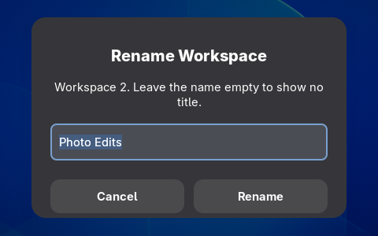
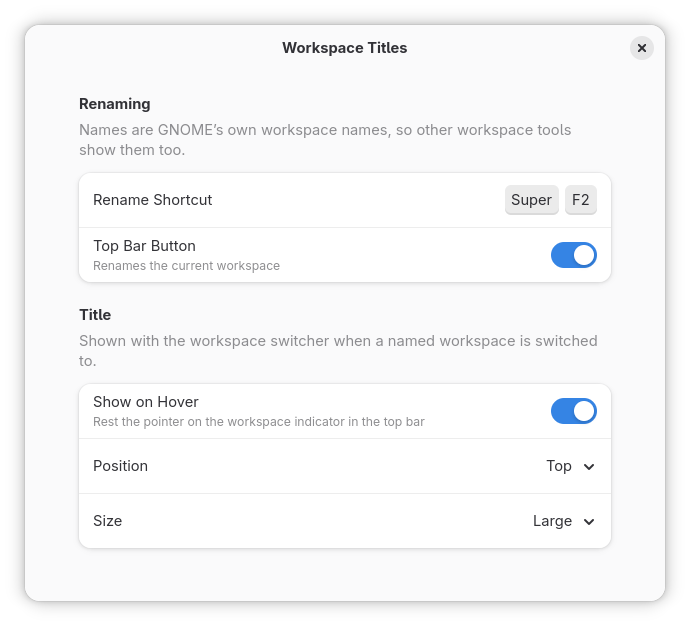

# Workspace Titles

Name your workspaces and see the name in large type when you switch to one.


When you switch workspaces with the keyboard, GNOME shows a row of dots near the bottom
of the screen. Workspace Titles adds the workspace's name near the top, in the same
rounded box as the dots, appearing and fading with them. A workspace without a name shows
no title. To see the current workspace's title without switching, rest the pointer on the
workspace dots at the left of the top bar for half a second.

To name the workspace you are on, press **Super+F2** or click the pencil in the top bar,
type the name and press Enter. Leave the name empty to remove it.



The names are GNOME's own (`org.gnome.desktop.wm.preferences workspace-names`), so other
workspace tools show them too. GNOME matches those names to workspaces by position; this
extension keeps each name with its workspace when one before it closes, as happens with
dynamic workspaces.

The title box uses the dots' own style, so themes and extensions that restyle the
workspace switcher (Blur my Shell, Just Perfection) restyle the title with it.

## Requirements

GNOME Shell 50.

## Privacy and network

It sends nothing anywhere. It reads and writes only GNOME's list of workspace names.

## Install

From source:

```bash
git clone https://github.com/Jackicus/GNOME-Workspace-Titles.git
cd GNOME-Workspace-Titles
make install
```

Then log out and back in (on Wayland the shell only finds a new extension at login), and
turn it on in Extensions.

To update, pull and `make install` again; to remove it, `make uninstall`.

## Preferences



- **Rename Shortcut**: Super+F2 to begin with. Click the row and press a new one,
  with Ctrl, Alt or Super; Backspace removes it.
- **Top Bar Button**: the pencil that renames the current workspace.
- **Show on Hover**: the title shows while the pointer rests on the workspace dots in
  the top bar.
- **Position**: the title at the top of the screen, or in its middle.
- **Size**: small, large or huge.

## Troubleshooting

The extension's messages, and its preferences', are in the journal:

```bash
journalctl -o cat --since '10 min ago' /usr/bin/gnome-shell + SYSLOG_IDENTIFIER=org.gnome.Shell.Extensions | grep -F '[Workspace Titles]'
```

Include them in a bug report.

## Development

See [CONTRIBUTING.md](CONTRIBUTING.md).

## Licence

GPL-2.0-or-later. See [LICENSE](LICENSE).
